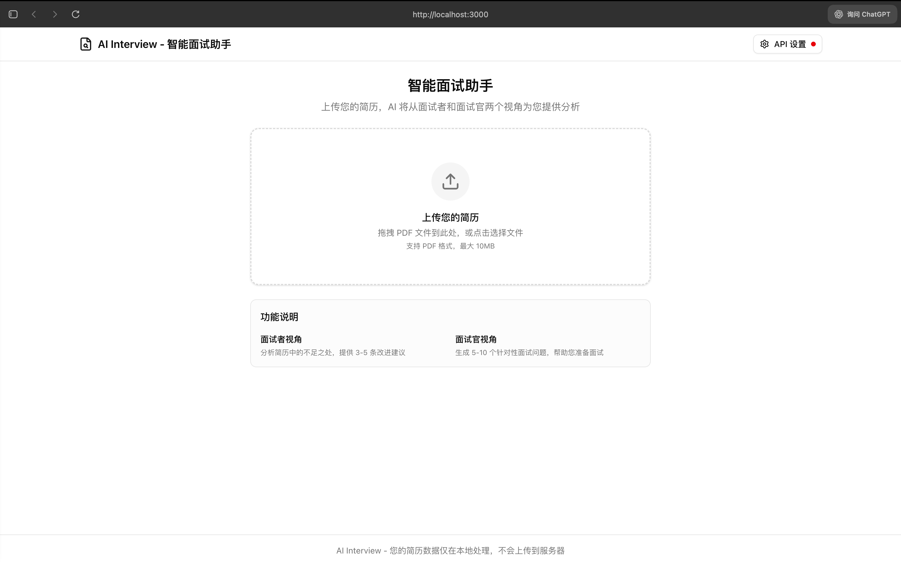
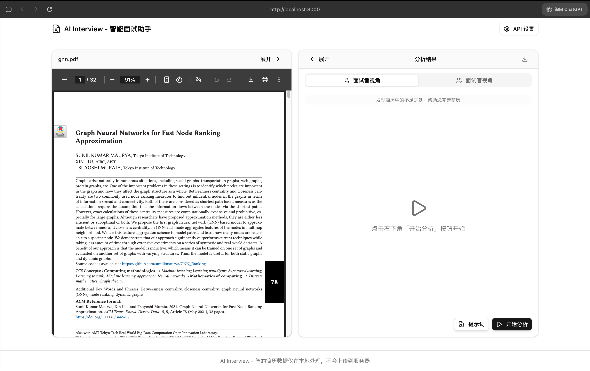

# AI Interview - 智能面试助手

一个纯前端的 AI 面试助手工具，支持 PDF 简历上传和预览，提供面试者视角和面试官视角两种分析模式。

## 预览





[>> 立即试用](https://ai-interview.arxivs.com)

## 功能特点

- **PDF 简历上传**：支持拖拽上传，自动解析 PDF 文本内容
- **简历预览**：左侧实时预览上传的 PDF 简历
- **双视角分析**：
  - **面试者视角**：分析简历中的不足之处，提供 3-5 条改进建议
  - **面试官视角**：生成 5-10 个针对性面试问题，帮助准备面试
- **自定义 API**：支持 OpenAI 兼容的 API 服务，用户可配置自己的 API Key
- **数据安全**：纯前端处理，简历数据不会上传到服务器

## 技术栈

- **框架**：Next.js 16
- **样式**：Tailwind CSS 4
- **UI 组件**：Shadcn/UI
- **图标**：Lucide React
- **PDF 处理**：pdfjs-dist

## 快速开始

### 安装依赖

```bash
pnpm install
```

### 启动开发服务器

```bash
pnpm dev
```

打开 [http://localhost:3000](http://localhost:3000) 查看应用。

### 构建生产版本

```bash
pnpm build
pnpm start
```

## Docker 部署

### 构建 Docker 镜像

```bash
docker build -t ai-interview .
```

如果需要指定构建参数（可选）：

```bash
docker build --build-arg NEXT_PUBLIC_API_URL=https://api.example.com/v1 -t ai-interview .
```

### 运行 Docker 容器

```bash
docker run -p 3000:3000 ai-interview
```

应用将在 [http://localhost:3000](http://localhost:3000) 上运行。

## 使用说明

1. 点击右上角「API 设置」按钮，配置您的 AI API 信息：
   - **API Base URL**：OpenAI 兼容的 API 地址（如 `https://api.openai.com/v1`）
   - **API Key**：您的 API 密钥
   - **Model Name**：使用的模型名称（如 `gpt-4o-mini`）

2. 上传您的 PDF 简历

3. 在右侧面板切换「面试者视角」或「面试官视角」查看分析结果

## 项目结构

```
app/
├── page.tsx                    # 主页面
├── layout.tsx                  # 布局
├── globals.css                 # 全局样式
components/
├── ui/                         # Shadcn UI 组件
├── pdf-upload.tsx              # PDF 上传组件
├── pdf-viewer.tsx              # PDF 预览组件
├── api-settings.tsx            # API 设置弹窗
└── analysis-panel.tsx          # 分析面板
lib/
├── pdf-parser.ts               # PDF 文本提取
├── ai-service.ts               # AI API 调用封装
├── prompts.ts                  # AI 提示词
└── utils.ts                    # 工具函数
hooks/
└── use-api-settings.ts         # API 配置 Hook
```

## License

[MIT](./LICENSE)
